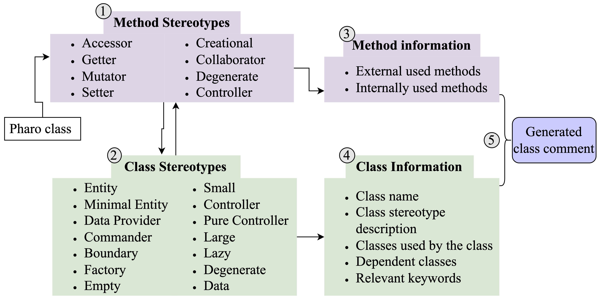
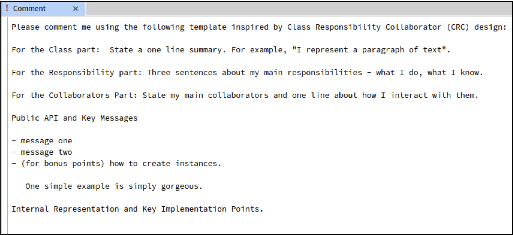
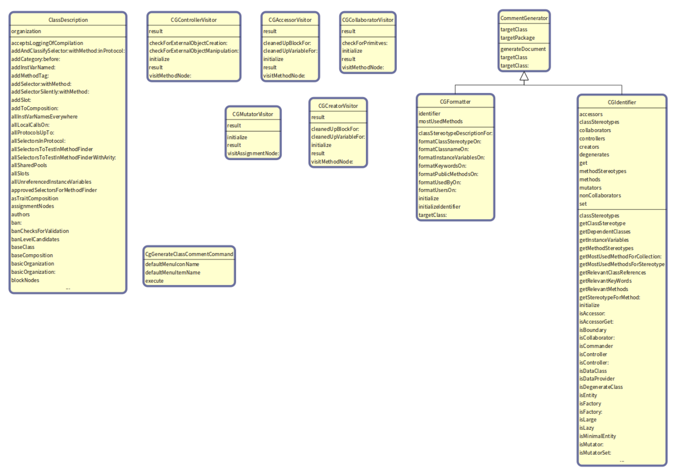

# Smalltalk-class-comment-generator

- This tool attempts to generate a smalltalk class comment as shown in figure . 

- The comment contains information types based on the default Pharo template 

## Overview

[1. Requirements](#requirements)<br />
[2. Installation](#installation)<br />
[3. Usage](#usage)<br />
[4. Development](#development)<br />
[5. References](#references)<br />
[6. License](#license)

## Requirements

- Pharo > 8.0

## Installation
```smalltalk
Metacello new
baseline: 'CommentGenerator';
repository: 'github://PR-research-data-tools/Smalltalk-class-comment-generator:main/src';
load.
```

## Usage

```smalltalk
|cg|
cg := CommentGenerator new.
cg targetClass: RSShape.
cg generateDocument.
```

## Development

There are various classes used to achieve class comment generation.


### Comment Generator classes

CommentGenerator class is one of the important classes. The user can pass a class of interest in `targetClass' and pass `generateDocument' message to generate class comment for the class.
It has two more important classes `CGIdentifier' and `CGFormatter' where the former contains most of the logic and latter formats the writestream output.

### Visitor classes

These classes are used to extract important or relevant information about a method. 
The visitor is setup by passing a method name (aSymbol).
```smalltalk
| method visitor |
   method := targetClass >> aSymbol.
   visitor := CGAccessorVisitor new.
   method ast acceptVisitor: visitor.
   visitor result
   ```

### Get Class Streotypes

```smalltalk
|ci|
ci := CGIdentifier new.
ci targetClass: RSShape.
ci getClassStereotype.
```

### Get Method Streotypes
```smalltalk
|ci|
ci := CGIdentifier new.
ci targetClass: RSShape.
ci getMethodStereotypes.
```


## References

- [Pharo](https://pharo.org/)
- [Paper: Can We Automatically Generate Class Comments in Pharo?](https://scg.unibe.ch/archive/papers/Rani22b.pdf)
- [Replication paper: Automatic generation of natural language summaries for java classes](https://ieeexplore.ieee.org/abstract/document/6613830)
- [replication package of the paper](https://doi.org/10.5281/zenodo.6622011)

## License

MIT License
